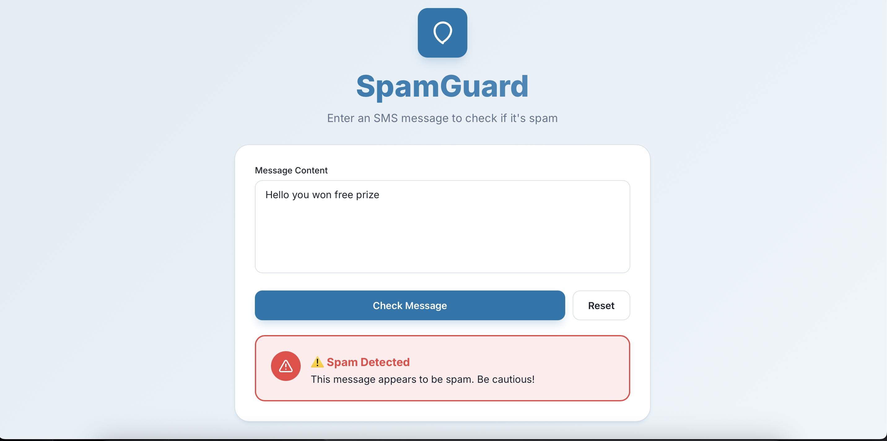
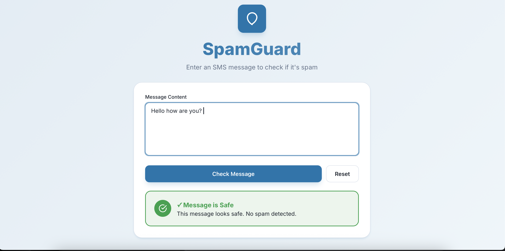

## SpamGuard 🛡️ ##
An end-to-end Machine Learning web app to classify SMS messages as "Spam" or "Ham" (not spam).

This project was built from scratch to demonstrate the full lifecycle of a modern AI-powered application—from model training to a fully deployed CI/CD pipeline.

🚀 View Live Project
Live App: https://spam-classifier-project-1.onrender.com/

Live API Docs: https://spam-classifier-project-vker.onrender.com/docs

📸 Application Preview
<p align="center">
  
</p>

<p align="center">
  
</p>

### 📖 About This Project
SpamGuard is a full-stack, machine learning application that classifies SMS messages. The user can enter any message, and the app will provide a real-time prediction as to whether the message is "Spam" or "Safe (Ham)".

### This repository demonstrates:

ML Model Training : A Multinomial Naive Bayes classifier was trained on the UCI SMS Spam Collection dataset using a TF-IDF Vectorizer, achieving ~95% accuracy.

Backend API: A FastAPI (Python) server hosts the pre-trained model.pkl file and provides a simple REST API endpoint (/predict) for predictions.

Frontend Interface: A clean, responsive single-page application built with HTML, CSS, and JavaScript that allows users to interact with the API.

CI/CD Deployment: The project is deployed using a continuous deployment pipeline. The GitHub repository is connected to Render, which automatically builds and deploys the backend (Web Service) and frontend (Static Site) on every git push.

### ✨ Features
Real-time Prediction: Classifies messages instantly.

Accurate ML Model: Built with Scikit-learn, Pandas, and a Naive Bayes classifier.

RESTful API: The backend API is fully documented and interactive via FastAPI's built-in Swagger UI.

Responsive Frontend: A sleek, mobile-friendly design.

Automated Deployment: CI/CD pipeline ensures the live app is always up-to-date with the main branch.

### 💻 Tech Stack
Area	Technology
Machine Learning	Scikit-learn, Pandas, Joblib
Backend	Python, FastAPI, Uvicorn, Gunicorn
Frontend	HTML5, CSS3, Vanilla JavaScript
Deployment	Git, GitHub, Render

### 📂 Project Structure
```bash
/spam-classifier-project
  ├── /backend
  │   ├── app.py          # The FastAPI server logic
  │   ├── model.pkl       # The pre-trained ML model
  │   └── requirements.txt# Python dependencies
  ├── /frontend
  │   ├── index.html      # App structure
  │   ├── style.css       # App styling
  │   └── script.js       # App logic (API calls)
  ├── /images
  │   ├── spam_got     
  │   ├── spam_not_got  
  ├── .gitignore
  └── README.md
```
### 🛠️ How to Run Locally
You can run this project on your local machine by following these steps.

Prerequisites

Python 3.10+

Git

A code editor (like VS Code)

1. Clone the Repository

```Bash
git clone https://github.com/Vireshkamlapure/spam-classifier-project
cd spam-classifier-project
```
2. Run the Backend (API)
The backend runs on http://127.0.0.1:8000.

```Bash
# Navigate to the backend folder
cd backend
```
```bash 
# Create a virtual environment
python -m venv .venv

# Activate the virtual environment
# Windows:
.venv\Scripts\activate
# Mac/Linux:
source .venv/bin/activate

# Install the required libraries
pip install -r requirements.txt
```
# Run the FastAPI server
```bash
uvicorn app:app --reload
```
You can now access your local API docs at http://127.0.0.1:8000/docs.

3. Run the Frontend

The frontend is a simple static site.

Open a new terminal (leave your backend running).

In the frontend/script.js file, make sure the API_URL is set to the local server:

```JavaScript
const API_URL = "http://127.0.0.1:8000/predict";
```
Open the frontend/index.html file directly in your web browser (or use the VS Code "Live Server" extension).